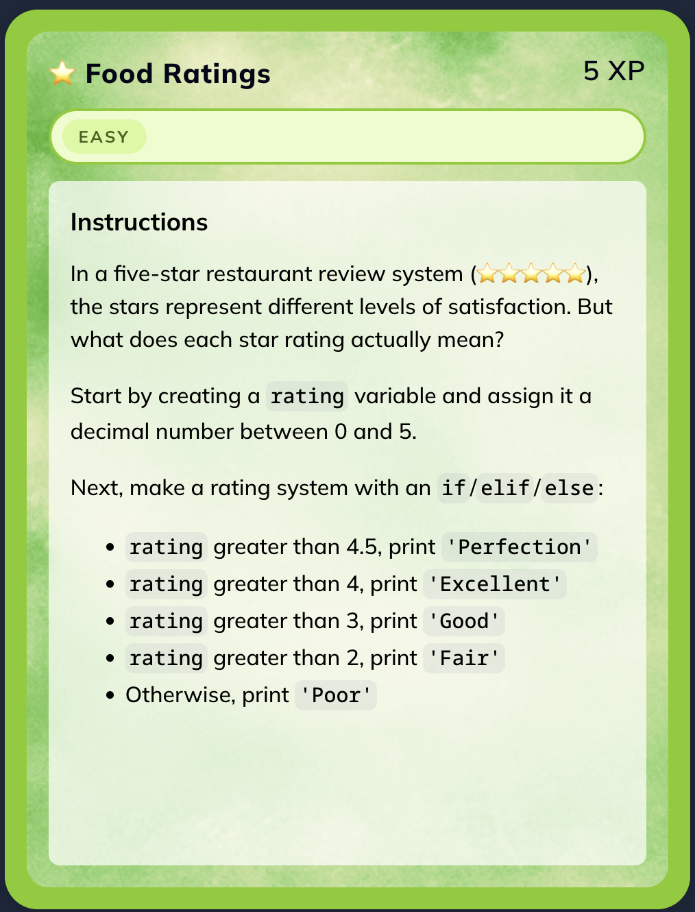
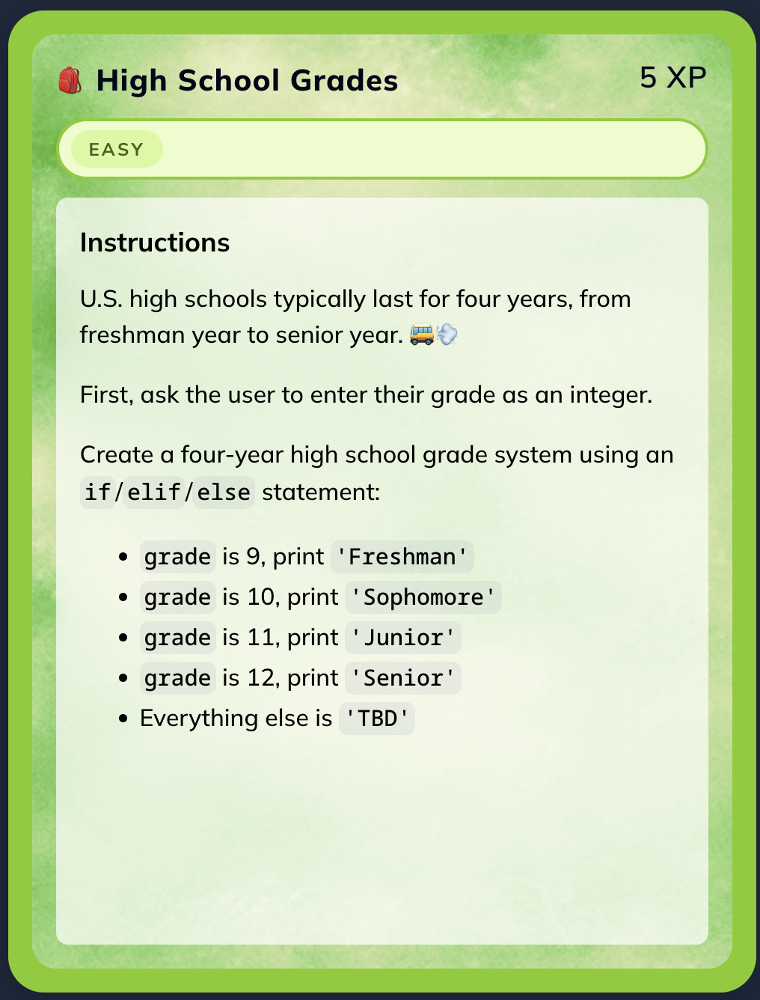
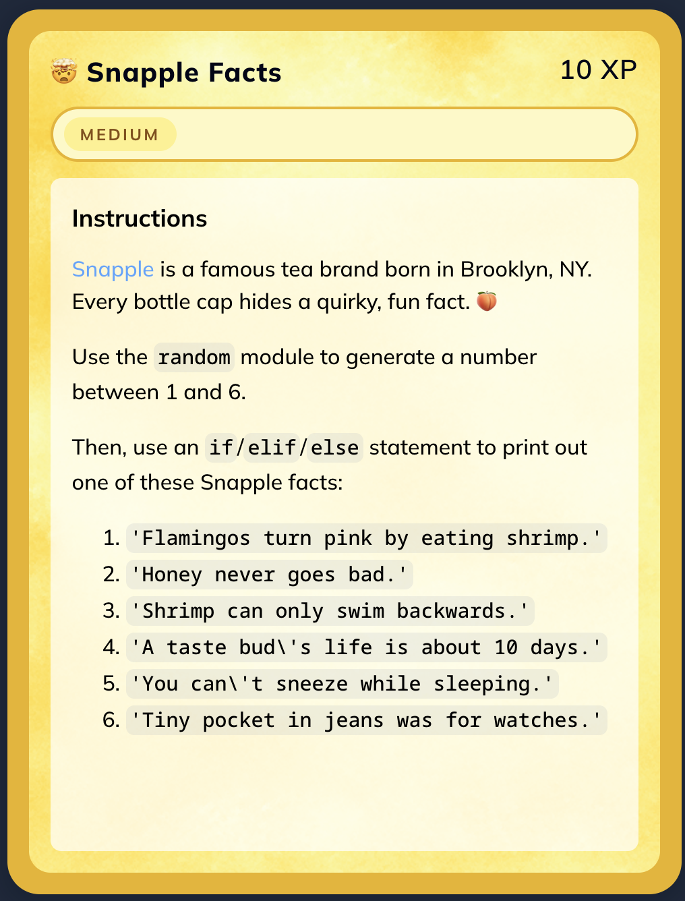
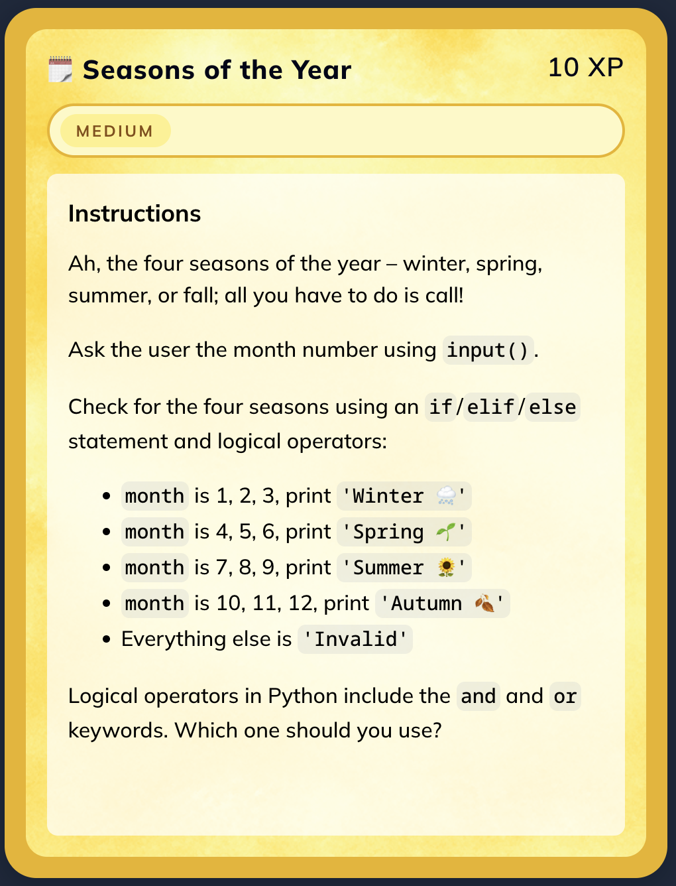
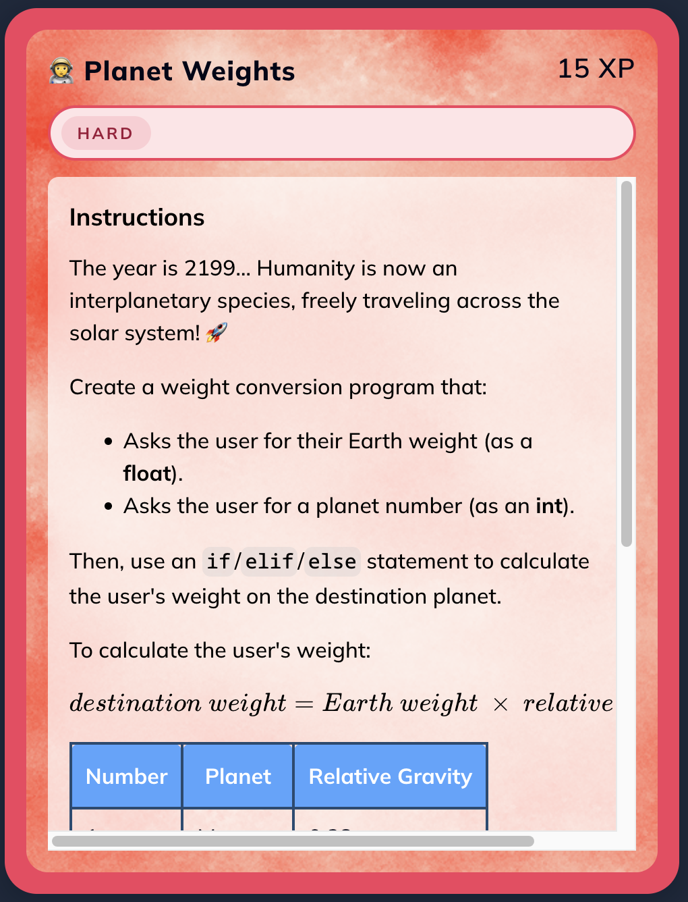
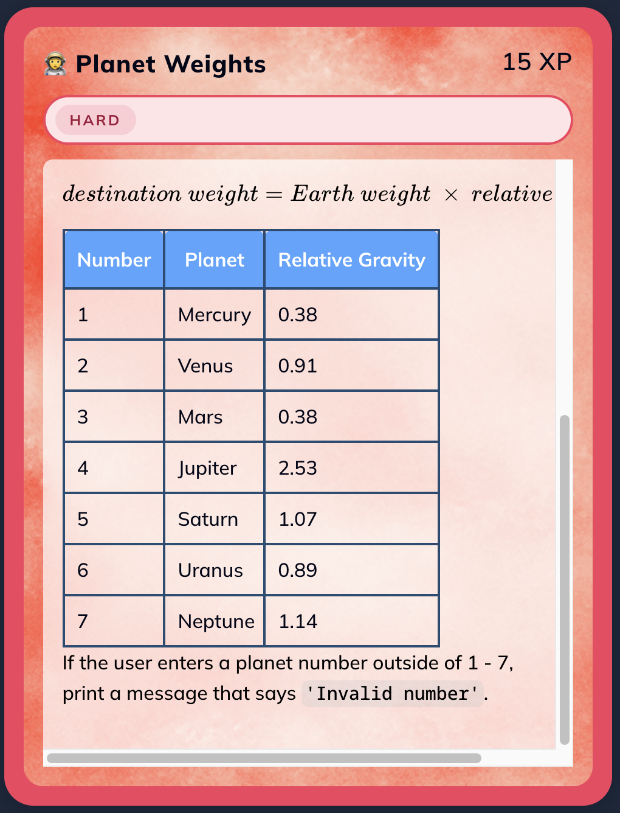

## Instructions



## Solution

```python

# Food Ratings
rating = 4.8

if rating > 4.5:
    print('Perfection')
elif rating > 4:
    print('Excellent')
elif rating > 3:
    print('Good')
elif rating > 2:
    print('Fair')
else:
    print('Poor')
    
```


## High School Grades



## Solution

```python

grade = int(input('Enter your grade: '))

if grade == 9:
    print('Freshman')
elif grade == 10:
    print('Sophomore')
elif grade == 11:
    print('Junior')
elif grade == 12:
    print('Senior')
else:
    print('TBD')
    
```


## Snapple Facts



## Solution

```python

import random

# Generate a random number between 1 and 6 inclusive
snapple_number = random.randint(1, 6)

# Select and print the corresponding Snapple fact
if snapple_number == 1:
    print("Flamingos turn pink by eating shrimp.")
elif snapple_number == 2:
    print("Honey never goes bad.")
elif snapple_number == 3:
    print("Shrimp can only swim backwards.")
elif snapple_number == 4:
    print("A taste bud's life is about 10 days.")
elif snapple_number == 5:
    print("You can't sneeze while sleeping.")
else:
    print("Tiny pocket in jeans was for watches.")
    
```


## Seasons of the Year



## Solution

```python

# Pedir el número de mes al usuario y convertirlo a entero
month = int(input("Enter month number: "))

# Verificar la estación usando operadores lógicos (or)
if month == 1 or month == 2 or month == 3:
    print("Winter 🌨️")
elif month == 4 or month == 5 or month == 6:
    print("Spring 🌱")
elif month == 7 or month == 8 or month == 9:
    print("Summer 🌻")
elif month == 10 or month == 11 or month == 12:
    print("Autumn 🍂")
else:
    print("Invalid")
    
```


## Planet Weights





## Solution

```python

earth_weight = float(input("Enter your Earth weight: "))
planet_number = int(input("Enter a planet number (1-7): "))

if planet_number == 1:
    destination_weight = earth_weight * 0.38
    print(destination_weight)
elif planet_number == 2:
    destination_weight = earth_weight * 0.91
    print(destination_weight)
elif planet_number == 3:
    destination_weight = earth_weight * 0.38
    print(destination_weight)
elif planet_number == 4:
    destination_weight = earth_weight * 2.53
    print(destination_weight)
elif planet_number == 5:
    destination_weight = earth_weight * 1.07
    print(destination_weight)
elif planet_number == 6:
    destination_weight = earth_weight * 0.89
    print(destination_weight)
elif planet_number == 7:
    destination_weight = earth_weight * 1.14
    print(destination_weight)
else:
    print("Invalid number")
    
```